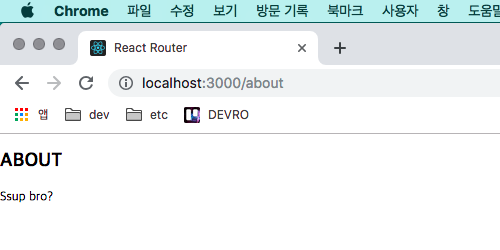

###### [Velopert](https://velopert.com/3417), [리액트를 다루는 기술](https://ridibooks.com/v2/Detail?id=754024217&_s=search&_q=%EB%A6%AC%EC%95%A1%ED%8A%B8%EB%A5%BC%20%EB%8B%A4%EB%A3%A8%EB%8A%94%20%EA%B8%B0%EC%88%A0) 참조

<br>

#### create-react-app 생성

```bash
$ cd Desktop
$ create-react-app react_router --scripts-version=1.1.5
```

<br>

#### React Router 설치

```bash
$ cd react_router
$ yarn add react-router-dom
$ code .
```

<br>

#### 프로젝트 초기화

###### 파일 제거

- `src/App.css`
- `src/App.test.js`
- `src/logo.svg`

<br>

###### 디렉토리 생성

- `src/components`
- `src/pages`

<br>

###### 코드 수정

- public/index.html

```html
...
<title>React Router</title>
...
```

<br>

#### NODE_PATH 설정

- package.json

```json
"scripts": {
   "start": "NODE_PATH=src react-scripts start",
   "build": "NODE_PATH=src react-scripts build",
   ...
}
```

<br>

#### 코드 수정

- src/App.js

```react
import React from 'react';

const App = () => {
   return (
      <h1>Ssup bro?</h1>
   )
}

export default App;
```

<br>

- src/Root.js

```react
import React from 'react';
import { BrowserRouter } from 'react-router-dom';
import App from './App';

const Root = () => {
   return (
      <BrowserRouter>
         <App />
      </BrowserRouter>
   )
}

export default Root;
```

<br>

- src/index.js

```react
import React from 'react';
import ReactDOM from 'react-dom';
import './index.css';
import Root from './Root';
import registerServiceWorker from './registerServiceWorker';

ReactDOM.render(
   <Root />,
   document.getElementById('root')
);
registerServiceWorker();
```

<br>

- Result:


<br>

#### Home, About 라우트 생성

- src/pages/Home.js

```react
import React from 'react';

const Home = () => {
   return (
      <div>
         <h2>HOME</h2>
      </div>
   )
}

export default Home;
```

<br>

- src/pages/About.js

```react
import React from 'react';

const About = () => {
   return (
      <div>
         <h2>ABOUT</h2>
         <p>Ssup bro?</p>
      </div>
   )
}

export default About;
```

<br>

- src/pages/index.js

```react
export { default as Home } from './Home';
export { default as About } from './About';
```

<br>

#### 라우트 설정

- src/App.js

```react
import React from 'react';
import { Route } from 'react-router-dom';
import { Home, About } from 'pages';

const App = () => {
   return (
      <div>
         <Route exact path="/" component={Home}/>
         <Route path="/about" component={About}/>
      </div>
   )
}

export default App;
```

<br>

- Result: `http://localhost:3000/`


<br>

- Result: `http://localhost:3000/about`



<br>

#### 라우트 파라미터 & 쿼리 읽기

<br>

###### params

- src/App.js

```react
import React from 'react';
import { Route } from 'react-router-dom';
import { Home, About } from 'pages';

const App = () => {
   return (
      <div>
         <Route exact path="/" component={Home}/>
         <Route path="/about" component={About}/>
         <Route path="/about/:name" component={About}/>
      </div>
   )
}

export default App;
```

<br>

- src/pages/About.js

```react
import React from 'react';

const About = ({match}) => {
   return (
      <div>
         <h2>ABOUT</h2>
         <p>Ssup bro? I'm {match.params.name}</p>
      </div>
   )
}

export default About;
```

<br>

- Result: `http://localhost:3000/about/react`


<br>

###### 중복 제거를 위해 코드 수정

- src/App.js

```react
import React from 'react';
import { Route } from 'react-router-dom';
import { Home, About } from 'pages';

const App = () => {
   return (
      <div>
         <Route exact path="/" component={Home}/>
         <Route exact path="/about" component={About}/>
         <Route path="/about/:name" component={About}/>
      </div>
   )
}

export default App;
```

<br>

- Result: `http://localhost:3000/about/react`


<br>

###### Query String

- 설치 필요

<br>

#### 라우트 이동

- src/components/Menu.js

```react
import React from 'react';
import { Link } from 'react-router-dom';

const Menu = () => {
   return (
      <div>
         <ul>
            <li><Link to="/">HOME</Link></li>
            <li><Link to="/about">ABOUT</Link></li>
            <li><Link to="/about/react">ABOUT React</Link></li>
         </ul>
      </div>
   )
}

export default Menu;
```

<br>

- src/App.js

```react
import React from 'react';
import { Route } from 'react-router-dom';
import { Home, About } from 'pages';
import Menu from 'components/Menu';

const App = () => {
   return (
      <div>
         <Menu />
         <Route exact path="/" component={Home}/>
         <Route exact path="/about" component={About}/>
         <Route path="/about/:name" component={About}/>
      </div>
   )
}

export default App;
```

<br>

- Result:


<br>

#### NavLink 컴포넌트

- src/components/Menu.js

```react
import React from 'react';
import { NavLink } from 'react-router-dom';

const Menu = () => {
   const activeStyle = {
      color: '#20a19c',
      fontSize: '2rem'
   }
   
   return (
      <div>
         <ul>
            <li><NavLink exact to="/" activeStyle={activeStyle}>HOME</NavLink></li>
            <li><NavLink exact to="/about" activeStyle={activeStyle}>ABOUT</NavLink></li>
            <li><NavLink to="/about/react" activeStyle={activeStyle}>ABOUT React</NavLink></li>
         </ul>
      </div>
   )
}

export default Menu;
```

<br>

- Result:


<br>

#### 라우트 in 라우트 (version 4)

- src/pages/Post.js

```react
import React from 'react';

const Post = ({match}) => {
   return (
      <div>
         포스트 {match.params.id}
      </div>
   )
}

export default Post;
```

<br>

- src/pages/Posts.js

```react
import React from 'react';
import { Link, Route } from 'react-router-dom';
import { Post } from 'pages';

const Posts = ({match}) => {
   return (
      <div>
         <h2>Post List</h2>
         <ul>
            <li><Link to={`${match.url}/1`}>Post #1</Link></li>
            <li><Link to={`${match.url}/2`}>Post #2</Link></li>
            <li><Link to={`${match.url}/3`}>Post #3</Link></li>
            <li><Link to={`${match.url}/4`}>Post #4</Link></li>
         </ul>
         <Route exact path={match.url} render={() => (<h3>Please select any post</h3>)} />
         <Route path={`${match.url}/:id`} component={Post} />
      </div>
   )
}

export default Posts;
```

<br>

- src/pages/index.js

```react
export { default as Home } from './Home';
export { default as About } from './About';
export { default as Post } from './Post';
export { default as Posts } from './Posts';
```

<br>

- src/shared/App.js

```react
import React, { Component } from 'react';
import { Route, Switch } from 'react-router-dom';
import { Home, About, Posts } from 'pages';
import Menu from 'components/Menu';

class App extends Component {
   render() {
      return (
         <div>
            <Menu />
            <Route exact path="/" component={Home} />
            <Switch>
               <Route path="/about/:name" compoenent={About} />
               <Route path="about" component={About} />
            </Switch>
            <Route path="/posts" component={Posts} />
         </div>
      )
   }
}

export default App;
```

<br>

- src/components/Menu.js

```react
import React from 'react';
import { NavLink } from 'react-router-dom';

const Menu = () => {
   const activeStyle = {
      color: '#20a19c',
      fontSize: '2rem'
   }
   
   return (
      <div>
         <ul>
            <li><NavLink exact to="/" activeStyle={activeStyle}>HOME</NavLink></li>
            <li><NavLink exact to="/about" activeStyle={activeStyle}>ABOUT</NavLink></li>
            <li><NavLink to="/about/react" activeStyle={activeStyle}>ABOUT React</NavLink></li>
            <li><NavLink to="/posts" activeStyle={activeStyle}>Posts</NavLink></li>
         </ul>
      </div>
   )
}

export default Menu;
```

<br>